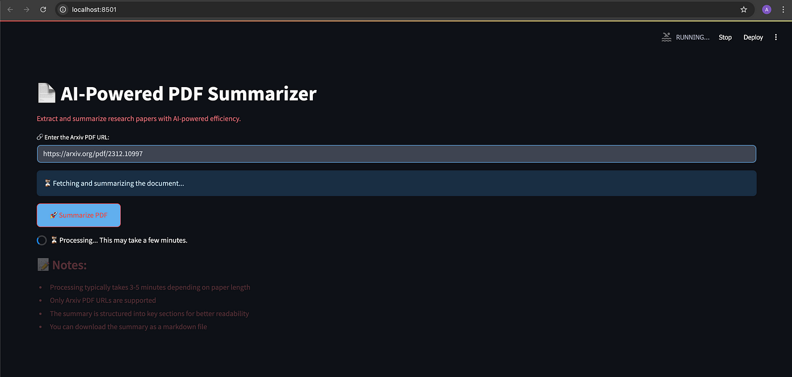

# Gemma 3 PDF Summarizer

A powerful PDF summarization tool that uses Google's Gemma 3 (via Ollama) to generate comprehensive technical summaries of academic papers, with a focus on extracting and organizing technical details.



## Features

- 📚 Arxiv PDF download and processing
- 🔍 Intelligent text extraction and chunking
- 🤖 Parallel processing with Gemma 3 LLM
- 📊 Structured technical summaries
- ⚡ FastAPI backend with async processing
- 🌐 Streamlit frontend interface

## System Requirements

- Python 3.8+
- Ollama with Gemma 3 model installed
- 16GB+ RAM recommended
- GPU recommended for faster processing

## Installation

1. Clone the repository:
```bash
git clone https://github.com/arjunprabhulal/gemma3_pdf_summarizer.git
cd gemma3_pdf_summarizer
```

2. Install dependencies:
```bash
pip install -r requirement.txt
```

3. Install and run Ollama with Gemma 3:
```bash
# Install Ollama from https://ollama.ai
ollama pull gemma3:27b
```

## Usage

1. Start the FastAPI backend:
```bash
python main.py
```

2. Start the Streamlit frontend in a new terminal:
```bash
streamlit run frontend.py
```

3. Access the web interface at `http://localhost:8501`

## Architecture

The system uses a parallel processing architecture to handle large PDFs efficiently:

1. **PDF Processing**: Downloads and extracts text from PDFs using PyMuPDF
2. **Text Chunking**: Splits text into optimal chunks for Gemma 3's context window
3. **Parallel Processing**: Processes chunks concurrently with retry mechanisms
4. **Summary Generation**: Creates structured technical summaries focusing on:
   - System Architecture
   - Technical Implementation
   - Infrastructure & Setup
   - Performance Analysis
   - Optimization Techniques

## API Endpoints

- `GET /health`: Health check endpoint
- `POST /summarize_arxiv/`: Main endpoint for PDF summarization
  - Input: `{"url": "https://arxiv.org/pdf/paper_id.pdf"}`
  - Output: Structured technical summary

## Contributing

Feel free to open issues or submit pull requests for improvements.

## License

MIT License
